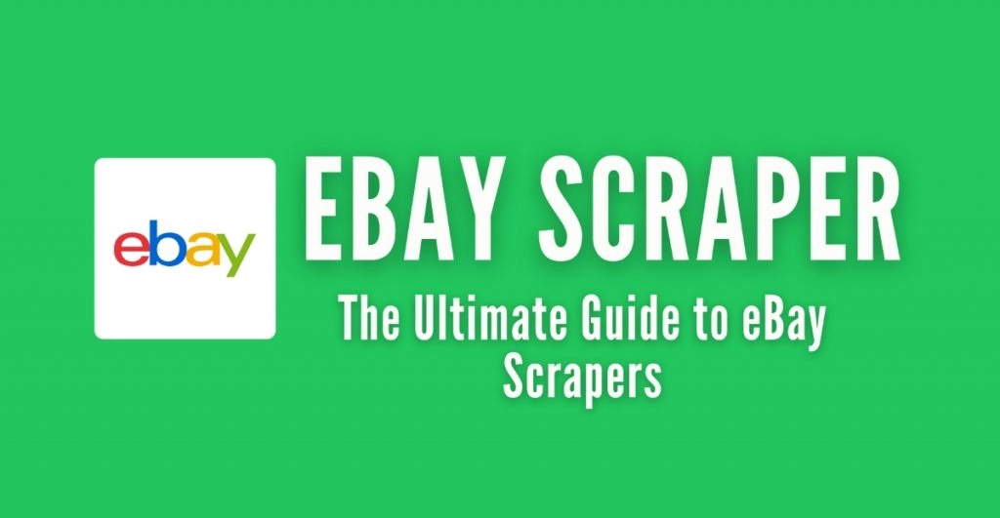
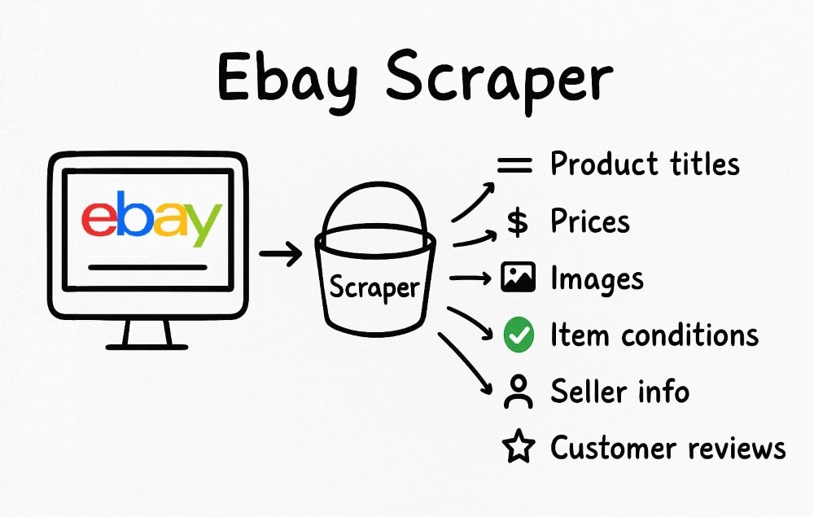
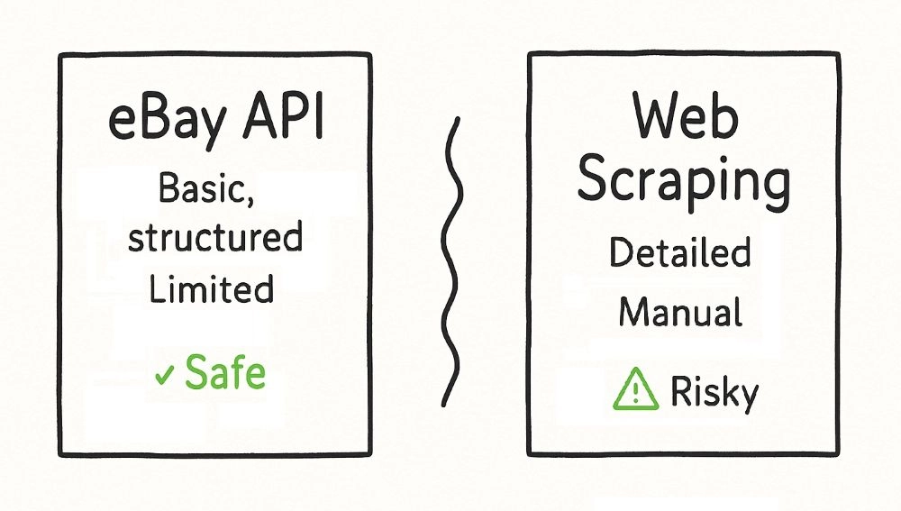
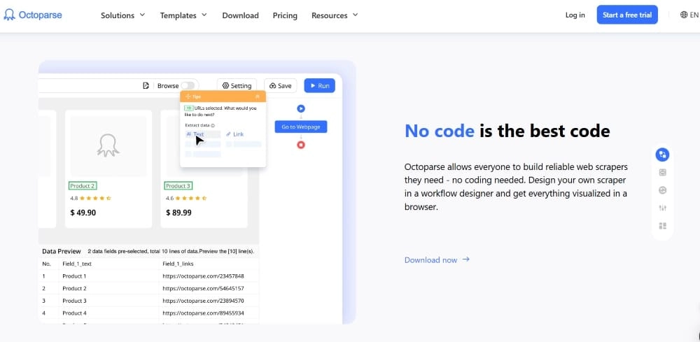
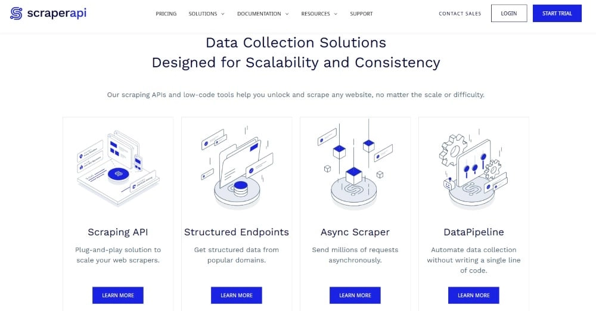
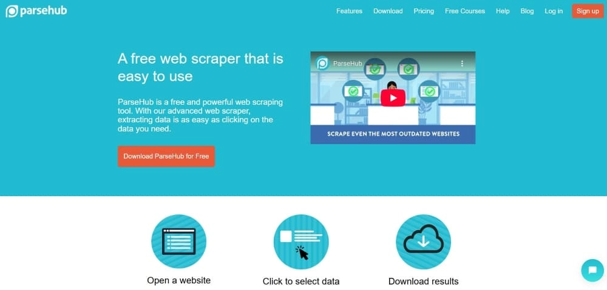
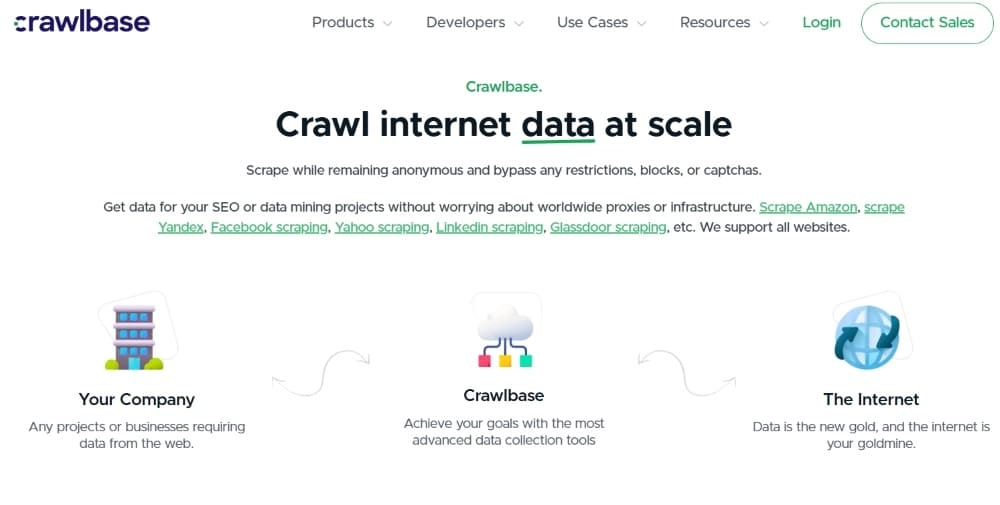
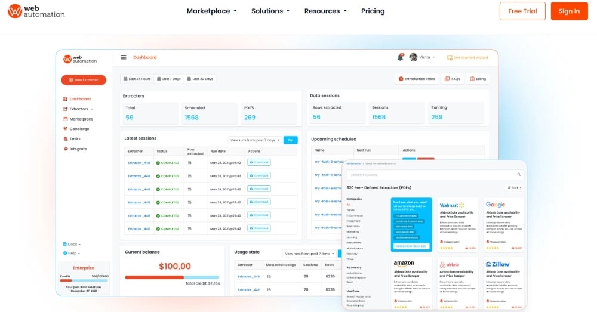
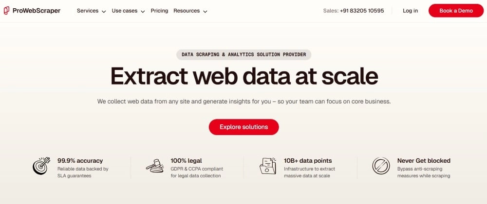
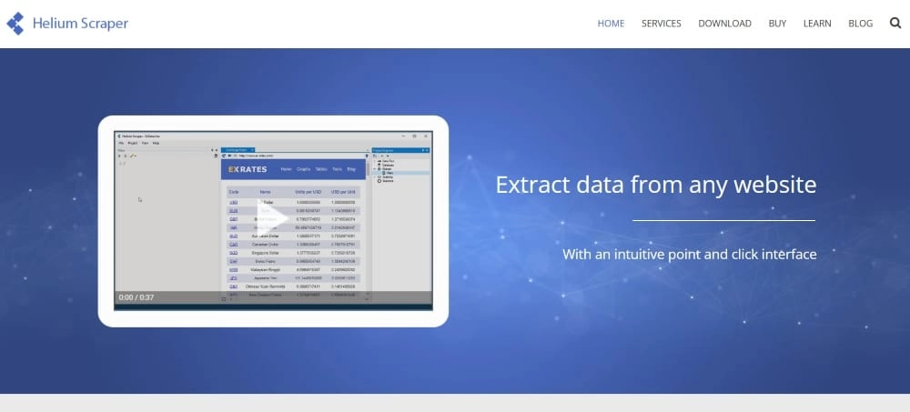

# The Ultimate Guide to eBay Scrapers (2025 Edition)

---

Learn how to build and deploy an eBay scraper in 2025—from Python basics to ready-made tools. Extract product data, avoid blocks, and stay within legal boundaries while gathering real-time pricing, reviews, and seller insights at scale.

---

So you're curious about eBay scrapers? Maybe you're tracking prices for resale, doing competitor research, or just want to see what's actually selling out there. Whatever your reason, an eBay scraper can pull all that public data—product titles, prices, reviews, seller ratings—without you clicking through hundreds of pages manually.

This guide walks you through the whole thing. What scrapers do, how to build one yourself, where the legal lines sit, and which tools are worth trying in 2025. No fluff, no sales pitch—just the real breakdown.



## What Is an eBay Scraper and Why Bother Using One?

An eBay scraper is basically a script that grabs public data straight from eBay's site—automatically, at whatever scale you need. Set it up right, and it can pull product titles, prices, images, item conditions, seller names, ratings, shipping fees, delivery windows, customer reviews, star ratings... you get the idea.

Some people scrape eBay for market research—tracking how prices shift across dozens or hundreds of listings over time. Others use it for competitor analysis, keeping tabs on what similar sellers are listing and how they're pricing things. And then there are folks building price comparison sites, mixing eBay data with stuff from Amazon, Walmart, and beyond.



**Why not just use the eBay API?** Good question. The API gives you clean JSON data, sure. But it's also limited—lots of fields are locked down or throttled by quotas. Scraping gives you full control and real-time access to whatever's publicly visible.

## Is It Legal to Scrape eBay? Here's the Actual Answer

Let's cut through the noise: **scraping public eBay listings isn't illegal**. But there are rules you need to follow.

**What you can scrape:**
- ✅ Public product listings (no login required)

**What you can't scrape:**
- ❌ User accounts or any data behind a login wall

Now, legality aside, there's still the practical side. If you slam eBay with too many requests too fast, you'll hit rate limits or get your IP banned. And legally, it's tricky—[eBay's Terms of Service](https://www.ebay.com/help/policies/member-behaviour-policies/user-agreement?id=4259) explicitly say: *"You may not use robots, scrapers, or data extraction tools unless authorized."*

So here's how to play it smart:
- Respect rate limits—don't flood the site
- Don't collect personal data (user details, private seller info)
- Avoid scraping while logged in (that crosses privacy lines)

**Bottom line:** Scrape smart. Don't collect what you shouldn't, don't hammer the site, and stay on the right side of both the law and common sense.

## eBay API vs Web Scraping – Which One Actually Wins?



Not sure whether to use the eBay API or just scrape the site directly? It depends on what you need and how much effort you're willing to invest.

**When the API makes sense:**
- You want official support
- You only need metadata (IDs, categories, basic info)
- You prefer well-documented JSON endpoints

**When scraping is better:**
- You want product reviews, full descriptions, or pricing per variant
- You need to track changes daily or pull data in bulk
- 👉 [You need reliable, scalable data extraction without API limitations](https://www.scraperapi.com/?fp_ref=coupons)

**Verdict:** If you just need the basics, the eBay API works fine. But for richer, real-world data—especially at scale—scraping (with the right setup) wins.

## How to Build a Free eBay Scraper with Python

If you know your way around Python, building your own eBay scraper is the most flexible and cost-effective route. Here's how to get started.

**Install the basics:**

```bash
pip install requests beautifulsoup4 lxml
```

**Basic scraper example (product search):**

```python
import requests
from bs4 import BeautifulSoup
import json

url = "https://www.ebay.com/sch/i.html?_nkw=airpods+pro"
headers = {
    "User-Agent": "Mozilla/5.0",
    "Accept-Language": "en-US,en;q=0.5"
}

response = requests.get(url, headers=headers)
soup = BeautifulSoup(response.text, "lxml")

results = []
listings = soup.find_all("div", class_="s-item__info")

for item in listings:
    title = item.find("h3")
    price = item.find("span", class_="s-item__price")
    if title and price:
        results.append({
            "title": title.text.strip(),
            "price": price.text.strip()
        })

print(json.dumps(results, indent=2))
```

### Three Ways to Avoid Getting Blocked

**Add headers (pretend you're a browser):**
Include headers like `User-Agent`, `Accept-Language`, and `Referer` so your scraper looks legit. Without them, eBay's systems can sniff you out and block or throttle your access.

**Use time.sleep() between requests:**
Pause 2–5 seconds between requests. Rapid-fire scraping gets you blocked fast. Randomizing sleep intervals helps mimic human behavior.

```python
import time, random
time.sleep(random.uniform(1.5, 4.0))
```

**Rotate IPs with proxies:**
Use rotating residential proxies to change your IP with each request. This keeps you under the radar, especially during large-scale scraping.

If you're planning to scrape at scale, adding a proxy layer is essential. It keeps your scraper running smoothly and your IP addresses clean.

## eBay Scraper Tools: 7 Best Options (Free & Paid)

Don't want to code? Here are the top scraper tools for 2025.

### 1. Octoparse – Best for Beginners



[Octoparse](https://www.octoparse.com/) is perfect if you're new to scraping. No-code interface, pre-built templates for eBay, auto-detects data fields, includes cloud scraping, scheduling, and IP rotation. Exports to CSV, Excel, API, or database.

### 2. ScraperAPI – Best for Developers



If you're coding your own scraper, [ScraperAPI](https://www.scraperapi.com/) handles IP rotation, headers, and CAPTCHAs automatically. Works with Python, Node.js, PHP, and Ruby. Delivers raw HTML, JSON, or structured data. Built for custom scrapers.

### 3. ParseHub – Best for Visual Workflows



[ParseHub](https://www.parsehub.com/) offers a drag-and-drop interface for intermediate users. Supports complex sites with AJAX, dropdowns, and popups. Scrapes multiple pages using loops or conditions. Exports to JSON, Excel, or CSV.

### 4. Crawlbase (ProxyCrawl) – Best for Large-Scale Projects



[Crawlbase](https://crawlbase.com/) focuses on high-volume data collection. Comes with datacenter proxies and an API-first approach. Reliably pulls product details, seller info, prices, and reviews across thousands of listings.

### 5. Web Automation Extractor – Best Browser-Based



[WebAutomation](https://webautomation.io/) runs directly in your browser—no installation needed. Great for one-off scrapes or small-scale research. Includes scheduling and custom workflows.

### 6. ProWebScraper – Best for Handling JavaScript



[ProWebScraper](https://www.prowebscraper.com/) excels at JavaScript-heavy pages. Handles AJAX, bypasses CAPTCHAs, supports custom user agents and pagination. Point-and-click interface backed by a strong rendering engine.

### 7. Helium Scraper – Best for Custom Workflows



[Helium Scraper](https://www.heliumscraper.com/) blends a visual interface with JavaScript scripting power. Supports massive datasets using SQLite (up to 140TB). Deep customization for advanced workflows—ideal for data engineers.

## Parsing the Data: Formats and Best Practices

Scraping is only step one. The real value shows up when you clean and actually use the data.

Raw output usually comes messy—weird characters, inconsistent formatting, duplicate entries. Without cleanup, even the best scraper won't help much.

**Common formats:**
- **CSV** – Great for spreadsheets and simple reports
- **JSON** – Better for APIs and structured databases

**Cleaning tips:**
- Strip whitespace and HTML tags
- Remove duplicate entries
- Normalize price values (drop the $ and convert to float)

```python
import csv

with open("ebay_data.csv", "w", newline="") as f:
    writer = csv.DictWriter(f, fieldnames=["title", "price"])
    writer.writeheader()
    writer.writerows(results)

for item in results:
    item["price"] = clean_price(item["price"])
```

Clean data isn't just prettier—it's what makes your analysis possible.

## Frequently Asked Questions

**Is there a free eBay scraper I can use?**

Yes. Octoparse offers a free plan with basic eBay scraping via no-code templates. Or you can build your own completely free script using Python with requests and BeautifulSoup.

**What's the best eBay scraper on GitHub?**

[ScrapFly's open-source repo](https://github.com/scrapfly/scrapfly-scrapers) is top-rated. Production-ready Python scrapers, integrates Scrapfly's API to bypass blocking, maintained with up-to-date examples.

**Is eBay scraping legal?**

Yes—scraping public data (product titles, prices, images) is legal as long as you respect eBay's robots.txt and avoid logging in or extracting personal info.

**What is the best eBay scraper Python script?**

In 2025, [ScrapFly's GitHub repository](https://github.com/scrapfly/scrapfly-scrapers) offers the most robust Python scripts. Production-ready, uses their SDK to bypass anti-bot defenses, supports async fetching, and integrates HTML parsing.

**How to avoid getting blocked while scraping?**

Use rotating proxies to switch IPs, add short sleep timers (2–5 seconds), use headless browsers like Puppeteer or Selenium, reuse cookies and session headers, and solve CAPTCHAs with tools like 2Captcha. Want it automated? [ScrapFly](https://scrapfly.io/) and [ScraperAPI](https://www.scraperapi.com/) handle proxies, headers, and more—no setup needed.

---

## Final Thoughts

Scraping eBay can unlock real insights—but only if you do it right. The built-in eBay API has limits. Scraping without a plan leads to IP bans or legal trouble. But with the right tools or a simple Python script, you can pull the data you need safely and efficiently.

Use this guide to start smart. Explore the scraper tools, follow best practices, stay within legal and ethical boundaries, and clean your data before using it. And if you're scaling up, 👉 [consider adding a reliable proxy solution to keep your scraper running smoothly](https://www.scraperapi.com/?fp_ref=coupons).
